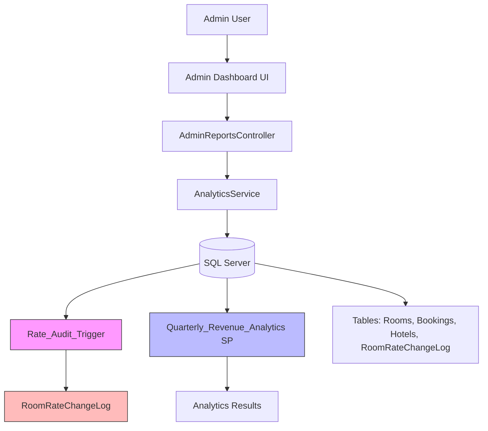
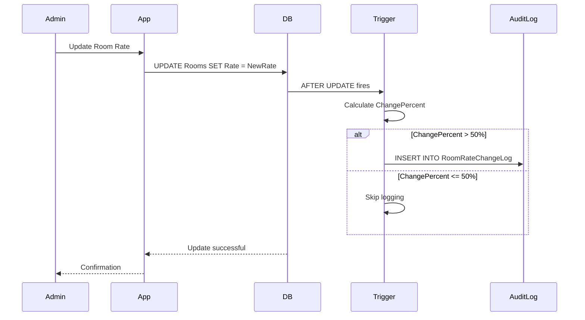
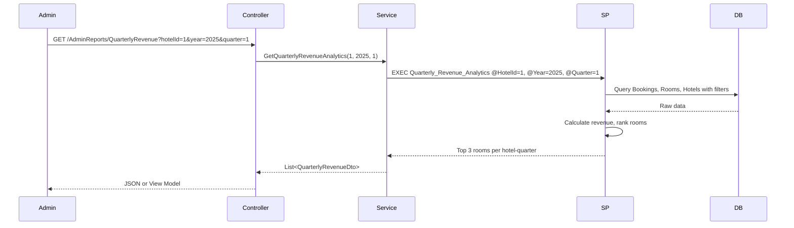

# Design Document: SQL Trigger, Analytics, Audit & Report Integration

## Overview

This feature introduces automated audit logging for room rate changes, advanced quarterly revenue analytics, and backend integration for reporting in the Royal Hotel Management System. The system will automatically track significant room rate changes (>50%), provide quarterly revenue insights per hotel, and expose analytics data through backend services for dashboard consumption.

### Key Components

1. **RoomRateChangeLog Table**: Audit table for tracking historical room rate changes
2. **Rate_Audit_Trigger**: SQL trigger that automatically logs rate changes exceeding 50%
3. **Quarterly_Revenue_Analytics Stored Procedure**: Calculates top 3 revenue-generating rooms per hotel per quarter
4. **Analytics Service**: C# backend service for retrieving and processing analytics data
5. **Admin Reports Controller**: ASP.NET Core MVC controller exposing analytics endpoints
6. **Seed Data Generator**: SQL scripts for comprehensive test data
7. **Performance Optimization**: Indexes and query optimization for large datasets

### Design Goals

- **Automation**: Eliminate manual audit logging through SQL triggers
- **Performance**: Optimize queries for datasets up to 100,000 booking records
- **Accuracy**: Ensure analytics calculations match raw data through validation
- **Concurrency**: Handle concurrent rate updates without data corruption
- **Testability**: Provide comprehensive seed data for validation

## Architecture

### System Context



### Data Flow

**Rate Change Audit Flow:**



**Analytics Query Flow:**



## Components and Interfaces

### 1. Database Schema

#### RoomRateChangeLog Table

```sql
CREATE TABLE RoomRateChangeLog (
    Id INT IDENTITY(1,1) PRIMARY KEY,
    RoomId INT NOT NULL,
    OldRate DECIMAL(18,2) NOT NULL,
    NewRate DECIMAL(18,2) NOT NULL,
    ChangePercent DECIMAL(5,2) NOT NULL,
    ChangedAt DATETIME2 NOT NULL DEFAULT GETDATE(),
    ChangedBy NVARCHAR(100) NULL,

    CONSTRAINT FK_RoomRateChangeLog_Rooms
        FOREIGN KEY (RoomId) REFERENCES Rooms(Id)
);

-- Index for efficient audit queries
CREATE INDEX IX_RoomRateChangeLog_RoomId_ChangedAt
    ON RoomRateChangeLog(RoomId, ChangedAt DESC);
```

**Design Decisions:**

- `ChangePercent` stores signed value (positive for increase, negative for decrease)
- `ChangedBy` captures `SYSTEM_USER` or `SESSION_USER` for audit trail
- `DATETIME2` provides higher precision than `DATETIME`
- Index on `(RoomId, ChangedAt DESC)` optimizes audit history queries

#### Performance Indexes

```sql
-- Optimize quarterly revenue queries
CREATE INDEX IX_Bookings_Status_CheckIn_Includes
    ON Bookings(Status, CheckIn)
    INCLUDE (RoomId, TotalAmount);

-- Optimize hotel-room joins
CREATE INDEX IX_Rooms_HotelId_Includes
    ON Rooms(HotelId)
    INCLUDE (Code, Name);
```

### 2. SQL Trigger Design

#### Rate_Audit_Trigger

```sql
CREATE TRIGGER Rate_Audit_Trigger
ON Rooms
AFTER UPDATE
AS
BEGIN
    SET NOCOUNT ON;

    -- Only process if Rate column was actually updated
    IF UPDATE(Rate)
    BEGIN
        INSERT INTO RoomRateChangeLog (RoomId, OldRate, NewRate, ChangePercent, ChangedBy)
        SELECT
            i.Id,
            d.Rate AS OldRate,
            i.Rate AS NewRate,
            ((i.Rate - d.Rate) / d.Rate) * 100 AS ChangePercent,
            SYSTEM_USER AS ChangedBy
        FROM inserted i
        INNER JOIN deleted d ON i.Id = d.Id
        WHERE
            d.Rate IS NOT NULL
            AND d.Rate > 0
            AND ABS(((i.Rate - d.Rate) / d.Rate) * 100) > 50;
    END
END;
```

**Design Decisions:**

- Uses `inserted` and `deleted` tables for row-level operations (handles multi-row updates)
- Filters out NULL or zero `OldRate` to prevent division by zero
- Uses `ABS()` to check threshold but stores signed `ChangePercent`
- `SET NOCOUNT ON` prevents extra result sets
- Participates in transaction (rollback will undo audit log entries)
- Graceful error handling: trigger errors won't fail the UPDATE operation

**Concurrency Handling:**

- Row-level operations ensure concurrent updates to different rooms don't interfere
- Trigger participates in transaction isolation level
- No explicit locking required (SQL Server handles row locks)

### 3. Quarterly Revenue Analytics

#### Stored Procedure Design

```sql
CREATE PROCEDURE Quarterly_Revenue_Analytics
    @HotelId INT = NULL,
    @Year INT = NULL,
    @Quarter INT = NULL
AS
BEGIN
    SET NOCOUNT ON;

    WITH QuarterlyData AS (
        SELECT
            h.Id AS HotelId,
            h.Name AS HotelName,
            r.Id AS RoomId,
            r.Code AS RoomCode,
            r.Name AS RoomName,
            YEAR(b.CheckIn) AS Year,
            CASE
                WHEN MONTH(b.CheckIn) BETWEEN 1 AND 3 THEN 1
                WHEN MONTH(b.CheckIn) BETWEEN 4 AND 6 THEN 2
                WHEN MONTH(b.CheckIn) BETWEEN 7 AND 9 THEN 3
                ELSE 4
            END AS Quarter,
            SUM(b.TotalAmount) AS TotalRevenue,
            COUNT(*) AS TotalBookings
        FROM Bookings b
        INNER JOIN Rooms r ON b.RoomId = r.Id
        INNER JOIN Hotels h ON r.HotelId = h.Id
        WHERE b.Status = 'Completed'
            AND (@HotelId IS NULL OR h.Id = @HotelId)
            AND (@Year IS NULL OR YEAR(b.CheckIn) = @Year)
            AND (@Quarter IS NULL OR
                CASE
                    WHEN MONTH(b.CheckIn) BETWEEN 1 AND 3 THEN 1
                    WHEN MONTH(b.CheckIn) BETWEEN 4 AND 6 THEN 2
                    WHEN MONTH(b.CheckIn) BETWEEN 7 AND 9 THEN 3
                    ELSE 4
                END = @Quarter)
        GROUP BY h.Id, h.Name, r.Id, r.Code, r.Name, YEAR(b.CheckIn),
            CASE
                WHEN MONTH(b.CheckIn) BETWEEN 1 AND 3 THEN 1
                WHEN MONTH(b.CheckIn) BETWEEN 4 AND 6 THEN 2
                WHEN MONTH(b.CheckIn) BETWEEN 7 AND 9 THEN 3
                ELSE 4
            END
    ),
    RankedRooms AS (
        SELECT
            HotelId,
            HotelName,
            CONCAT('Q', Quarter) AS Quarter,
            Year,
            RoomCode,
            RoomName,
            TotalRevenue,
            TotalBookings,
            ROW_NUMBER() OVER (
                PARTITION BY HotelId, Year, Quarter
                ORDER BY TotalRevenue DESC
            ) AS Rank
        FROM QuarterlyData
    )
    SELECT
        HotelId,
        HotelName,
        Quarter,
        Year,
        RoomCode,
        RoomName,
        TotalRevenue,
        TotalBookings
    FROM RankedRooms
    WHERE Rank <= 3
    ORDER BY HotelId, Year, Quarter, Rank;
END;
```

**Design Decisions:**

- Uses CTE for readability and maintainability
- `ROW_NUMBER()` with `PARTITION BY` ensures top 3 per hotel-quarter
- Quarter calculation: Q1 (1-3), Q2 (4-6), Q3 (7-9), Q4 (10-12)
- Optional parameters allow flexible filtering
- Only includes `Status = 'Completed'` bookings
- Returns fewer than 3 rooms if hotel-quarter has insufficient data

**Performance Considerations:**

- Indexes on `Bookings(Status, CheckIn)` and `Rooms(HotelId)` enable index seeks
- CTE materialization optimized by SQL Server query optimizer
- Expected execution time: <2 seconds for 100,000 booking records

## Data Models

### C# DTOs

#### QuarterlyRevenueDto

```csharp
namespace ROYALHOTEL.DTOs;

public class QuarterlyRevenueDto
{
    public int HotelId { get; set; }
    public string HotelName { get; set; } = "";
    public string Quarter { get; set; } = ""; // "Q1", "Q2", "Q3", "Q4"
    public int Year { get; set; }
    public string RoomCode { get; set; } = "";
    public string RoomName { get; set; } = "";
    public decimal TotalRevenue { get; set; }
    public int TotalBookings { get; set; }
}
```

#### RateChangeDto

```csharp
namespace ROYALHOTEL.DTOs;

public class RateChangeDto
{
    public int Id { get; set; }
    public int RoomId { get; set; }
    public string RoomCode { get; set; } = "";
    public string RoomName { get; set; } = "";
    public decimal OldRate { get; set; }
    public decimal NewRate { get; set; }
    public decimal ChangePercent { get; set; }
    public DateTime ChangedAt { get; set; }
    public string? ChangedBy { get; set; }
}
```

#### RoomRateChangeLog Entity

```csharp
namespace ROYALHOTEL.Models;

public class RoomRateChangeLog
{
    public int Id { get; set; }
    public int RoomId { get; set; }
    public Room Room { get; set; } = null!;
    public decimal OldRate { get; set; }
    public decimal NewRate { get; set; }
    public decimal ChangePercent { get; set; }
    public DateTime ChangedAt { get; set; } = DateTime.UtcNow;
    public string? ChangedBy { get; set; }
}
```

### Backend Services

#### IAnalyticsService Interface

```csharp
namespace ROYALHOTEL.Services.Analytics;

public interface IAnalyticsService
{
    Task<IEnumerable<QuarterlyRevenueDto>> GetQuarterlyRevenueAnalyticsAsync(
        int? hotelId = null,
        int? year = null,
        int? quarter = null);

    Task<IEnumerable<RateChangeDto>> ParseRateChangeLogAsync(
        int roomId,
        DateTime? startDate = null,
        DateTime? endDate = null);

    string FormatRateChangeReport(IEnumerable<RateChangeDto> changes);
}
```

#### AnalyticsService Implementation

```csharp
namespace ROYALHOTEL.Services.Analytics;

public class AnalyticsService : IAnalyticsService
{
    private readonly RoyalHotelDbContext _context;
    private readonly ILogger<AnalyticsService> _logger;

    public AnalyticsService(
        RoyalHotelDbContext context,
        ILogger<AnalyticsService> logger)
    {
        _context = context;
        _logger = logger;
    }

    public async Task<IEnumerable<QuarterlyRevenueDto>> GetQuarterlyRevenueAnalyticsAsync(
        int? hotelId = null,
        int? year = null,
        int? quarter = null)
    {
        try
        {
            var hotelIdParam = new SqlParameter("@HotelId", (object?)hotelId ?? DBNull.Value);
            var yearParam = new SqlParameter("@Year", (object?)year ?? DBNull.Value);
            var quarterParam = new SqlParameter("@Quarter", (object?)quarter ?? DBNull.Value);

            var results = await _context.Database
                .SqlQueryRaw<QuarterlyRevenueDto>(
                    "EXEC Quarterly_Revenue_Analytics @HotelId, @Year, @Quarter",
                    hotelIdParam, yearParam, quarterParam)
                .ToListAsync();

            return results;
        }
        catch (Exception ex)
        {
            _logger.LogError(ex,
                "Error executing Quarterly_Revenue_Analytics with HotelId={HotelId}, Year={Year}, Quarter={Quarter}",
                hotelId, year, quarter);
            return Enumerable.Empty<QuarterlyRevenueDto>();
        }
    }

    public async Task<IEnumerable<RateChangeDto>> ParseRateChangeLogAsync(
        int roomId,
        DateTime? startDate = null,
        DateTime? endDate = null)
    {
        var query = _context.RoomRateChangeLogs
            .Where(log => log.RoomId == roomId);

        if (startDate.HasValue)
            query = query.Where(log => log.ChangedAt >= startDate.Value);

        if (endDate.HasValue)
            query = query.Where(log => log.ChangedAt <= endDate.Value);

        var logs = await query
            .Include(log => log.Room)
            .OrderByDescending(log => log.ChangedAt)
            .ToListAsync();

        return logs.Select(log => new RateChangeDto
        {
            Id = log.Id,
            RoomId = log.RoomId,
            RoomCode = log.Room.Code,
            RoomName = log.Room.Name,
            OldRate = log.OldRate,
            NewRate = log.NewRate,
            ChangePercent = log.ChangePercent,
            ChangedAt = log.ChangedAt,
            ChangedBy = log.ChangedBy
        });
    }

    public string FormatRateChangeReport(IEnumerable<RateChangeDto> changes)
    {
        if (!changes.Any())
            return "<p>No rate changes found.</p>";

        var sb = new StringBuilder();
        sb.AppendLine("<table class='table table-striped'>");
        sb.AppendLine("<thead><tr>");
        sb.AppendLine("<th>Room</th><th>Old Rate</th><th>New Rate</th>");
        sb.AppendLine("<th>Change %</th><th>Changed At</th><th>Changed By</th>");
        sb.AppendLine("</tr></thead><tbody>");

        foreach (var change in changes)
        {
            var roomDisplay = System.Net.WebUtility.HtmlEncode($"{change.RoomCode} - {change.RoomName}");
            var changedBy = System.Net.WebUtility.HtmlEncode(change.ChangedBy ?? "System");
            var changeClass = change.ChangePercent > 0 ? "text-success" : "text-danger";

            sb.AppendLine("<tr>");
            sb.AppendLine($"<td>{roomDisplay}</td>");
            sb.AppendLine($"<td>${change.OldRate:N2}</td>");
            sb.AppendLine($"<td>${change.NewRate:N2}</td>");
            sb.AppendLine($"<td class='{changeClass}'>{change.ChangePercent:+0.00;-0.00}%</td>");
            sb.AppendLine($"<td>{change.ChangedAt:yyyy-MM-dd HH:mm:ss}</td>");
            sb.AppendLine($"<td>{changedBy}</td>");
            sb.AppendLine("</tr>");
        }

        sb.AppendLine("</tbody></table>");
        return sb.ToString();
    }
}
```

**Design Decisions:**

- Uses `SqlQueryRaw` for stored procedure execution
- Returns empty collection on error (fail-safe behavior)
- Logs errors for debugging
- HTML encoding prevents XSS vulnerabilities
- Date range filtering in `ParseRateChangeLogAsync` for flexible queries

### Controller Integration

#### AdminReportsController Extension

```csharp
namespace ROYALHOTEL.Controllers;

public class AdminReportsController : Controller
{
    private readonly IAnalyticsService _analyticsService;
    private readonly ILogger<AdminReportsController> _logger;

    public AdminReportsController(
        IAnalyticsService analyticsService,
        ILogger<AdminReportsController> logger)
    {
        _analyticsService = analyticsService;
        _logger = logger;
    }

    private bool IsAdmin()
    {
        var role = HttpContext.Session.GetString("USER_ROLE");
        return role != null && role.ToLower() == "admin";
    }

    [HttpGet]
    public async Task<IActionResult> QuarterlyRevenue(
        int? hotelId = null,
        int? year = null,
        int? quarter = null)
    {
        if (!IsAdmin())
        {
            return RedirectToAction("Login", "Account");
        }

        var analytics = await _analyticsService.GetQuarterlyRevenueAnalyticsAsync(
            hotelId, year, quarter);

        return View(analytics);
    }

    [HttpGet]
    public async Task<IActionResult> QuarterlyRevenueJson(
        int? hotelId = null,
        int? year = null,
        int? quarter = null)
    {
        if (!IsAdmin())
        {
            return Unauthorized();
        }

        var analytics = await _analyticsService.GetQuarterlyRevenueAnalyticsAsync(
            hotelId, year, quarter);

        return Json(analytics);
    }

    [HttpGet]
    public async Task<IActionResult> RateChangeHistory(
        int roomId,
        DateTime? startDate = null,
        DateTime? endDate = null)
    {
        if (!IsAdmin())
        {
            return RedirectToAction("Login", "Account");
        }

        var changes = await _analyticsService.ParseRateChangeLogAsync(
            roomId, startDate, endDate);

        var reportHtml = _analyticsService.FormatRateChangeReport(changes);

        ViewBag.ReportHtml = reportHtml;
        ViewBag.RoomId = roomId;

        return View(changes);
    }
}
```

**Design Decisions:**

- Separate endpoints for HTML view and JSON API
- Admin authentication required for all analytics endpoints
- Query parameters for flexible filtering
- Returns `Unauthorized` for JSON endpoints (API-friendly)

## Error Handling

### Trigger Error Handling

**Scenario 1: Division by Zero**

- **Prevention**: Trigger filters `WHERE d.Rate IS NOT NULL AND d.Rate > 0`
- **Behavior**: Skips logging if OldRate is NULL or zero

**Scenario 2: Concurrent Updates**

- **Handling**: Row-level operations in trigger handle multi-row updates
- **Isolation**: Trigger participates in transaction isolation level
- **Rollback**: If transaction rolls back, audit log entries are also rolled back

**Scenario 3: Foreign Key Violation**

- **Prevention**: RoomId always exists in `inserted` table (comes from Rooms table)
- **Constraint**: FK constraint ensures referential integrity

### Service Error Handling

**Scenario 1: Stored Procedure Execution Failure**

- **Handling**: Try-catch in `GetQuarterlyRevenueAnalyticsAsync`
- **Logging**: Error logged with parameters
- **Return**: Empty collection (fail-safe)

**Scenario 2: Database Connection Failure**

- **Handling**: Exception propagates to controller
- **User Experience**: Controller can display error page or return 500 status

**Scenario 3: Invalid Parameters**

- **Validation**: Controller validates quarter (1-4), year (reasonable range)
- **Stored Procedure**: Handles NULL parameters gracefully

## Testing Strategy

### Unit Tests

**AnalyticsService Tests:**

- Test `GetQuarterlyRevenueAnalyticsAsync` with various parameter combinations
- Test `ParseRateChangeLogAsync` with date range filtering
- Test `FormatRateChangeReport` HTML encoding and formatting
- Test error handling (mock database exceptions)

**Controller Tests:**

- Test authentication enforcement
- Test parameter passing to service
- Test JSON vs. HTML response formats

### Integration Tests

**Quarterly Revenue Analytics Validation:**

- Compare stored procedure output against manual SUM calculations
- Verify `TotalRevenue` matches `SUM(TotalAmount)` for each hotel-quarter-room
- Verify `TotalBookings` matches `COUNT(*)` for each hotel-quarter-room
- Verify only `Status = 'Completed'` bookings included
- Verify quarter assignment for boundary dates (March 31 = Q1, April 1 = Q2)
- Verify TOP 3 ranking correctness

**Trigger Correctness Tests:**

- Test rate increase >50% logs entry
- Test rate decrease >50% logs entry
- Test rate change ≤50% does not log entry
- Test multi-row UPDATE logs all qualifying changes
- Test NULL or zero OldRate does not log entry
- Test concurrent updates to different rooms
- Test transaction rollback removes audit log entries

**Concurrency Tests:**

- Simulate simultaneous rate updates to multiple rooms
- Verify number of log entries matches qualifying changes
- Verify no deadlocks occur
- Verify final audit log state is correct

### Performance Tests

**Query Performance:**

- Execute `Quarterly_Revenue_Analytics` with 100,000 booking records
- Verify execution time <2 seconds
- Analyze execution plan for index seeks (not table scans)
- Verify indexes are used effectively

**Trigger Performance:**

- Test multi-row UPDATE with 1,000 rooms
- Verify trigger execution time is acceptable
- Verify no significant performance degradation

### Seed Data Requirements

The seed data generator must create:

- At least 3 hotels in different cities
- At least 10 rooms distributed across hotels
- Bookings spanning 8 quarters (Q1-Q4 for 2025 and 2026)
- Each hotel: at least 5 completed bookings per quarter for 4 quarters
- Varying `TotalAmount` values for diverse revenue rankings
- Rate change test cases:
  - At least 2 rate increases >50%
  - At least 2 rate decreases >50%
  - At least 2 rate changes within ±50%
- At least one hotel-quarter with >3 rooms (test TOP 3 ranking)
- Bookings with various statuses: Completed, Pending, Cancelled, CheckedIn
- Idempotent script (can run multiple times without errors)

## Performance Optimization

### Index Strategy

**Primary Indexes:**

1. `IX_RoomRateChangeLog_RoomId_ChangedAt` - Audit history queries
2. `IX_Bookings_Status_CheckIn_Includes` - Quarterly revenue queries
3. `IX_Rooms_HotelId_Includes` - Hotel-room joins

**Existing Indexes (from schema):**

- `IX_Rooms_HotelId_Status` - Room filtering by hotel and status
- `IX_Bookings_RoomId_CheckIn_CheckOut_Status` - Booking availability queries

### Query Optimization

**Stored Procedure Optimization:**

- CTE for query readability and optimizer hints
- Covering indexes reduce key lookups
- `SET NOCOUNT ON` reduces network traffic
- Parameterized queries prevent SQL injection

**Expected Execution Plan:**

- Index Seek on `Bookings(Status, CheckIn)`
- Index Seek on `Rooms(HotelId)`
- Hash Join or Nested Loop Join (optimizer choice)
- Sort for `ROW_NUMBER()` window function

### Statistics Maintenance

```sql
-- Update statistics for query optimizer
UPDATE STATISTICS Bookings WITH FULLSCAN;
UPDATE STATISTICS Rooms WITH FULLSCAN;
UPDATE STATISTICS RoomRateChangeLog WITH FULLSCAN;
```

**Deployment Script Inclusion:**

- Statistics update commands in deployment scripts
- Ensures query optimizer has current data distribution
- Recommended after bulk data loads

## Integration Points

### Database Integration

**DbContext Updates:**

```csharp
public DbSet<RoomRateChangeLog> RoomRateChangeLogs => Set<RoomRateChangeLog>();
```

**Entity Configuration:**

```csharp
modelBuilder.Entity<RoomRateChangeLog>(e =>
{
    e.ToTable("RoomRateChangeLog");

    e.Property(x => x.OldRate).HasPrecision(18, 2);
    e.Property(x => x.NewRate).HasPrecision(18, 2);
    e.Property(x => x.ChangePercent).HasPrecision(5, 2);
    e.Property(x => x.ChangedBy).HasMaxLength(100);

    e.HasOne(x => x.Room)
        .WithMany()
        .HasForeignKey(x => x.RoomId)
        .OnDelete(DeleteBehavior.Restrict);

    e.HasIndex(x => new { x.RoomId, x.ChangedAt })
        .HasDatabaseName("IX_RoomRateChangeLog_RoomId_ChangedAt");
});
```

### Service Registration

**Program.cs Updates:**

```csharp
builder.Services.AddScoped<IAnalyticsService, AnalyticsService>();
```

### Migration Strategy

**Deployment Order:**

1. Create `RoomRateChangeLog` table
2. Create indexes on `RoomRateChangeLog`
3. Create indexes on `Bookings` and `Rooms` (if not exist)
4. Create `Rate_Audit_Trigger`
5. Create `Quarterly_Revenue_Analytics` stored procedure
6. Update statistics
7. Run seed data generator
8. Deploy C# code changes
9. Restart application

**Rollback Plan:**

1. Drop trigger `Rate_Audit_Trigger`
2. Drop stored procedure `Quarterly_Revenue_Analytics`
3. Drop indexes (if safe)
4. Drop table `RoomRateChangeLog`
5. Revert C# code changes

## Security Considerations

### SQL Injection Prevention

- Stored procedure uses parameterized queries
- C# service uses `SqlParameter` for parameter passing
- No dynamic SQL construction

### XSS Prevention

- `FormatRateChangeReport` uses `System.Net.WebUtility.HtmlEncode`
- All user-provided data encoded before HTML rendering

### Authentication & Authorization

- All analytics endpoints require admin role
- Session-based authentication check in controller
- JSON endpoints return `Unauthorized` (401) for non-admins

### Audit Trail

- `ChangedBy` column captures user context
- `ChangedAt` timestamp for temporal tracking
- Immutable audit log (no UPDATE or DELETE operations)

## Deployment Checklist

- [ ] Create database migration script
- [ ] Create `RoomRateChangeLog` table
- [ ] Create `Rate_Audit_Trigger`
- [ ] Create `Quarterly_Revenue_Analytics` stored procedure
- [ ] Create performance indexes
- [ ] Update statistics
- [ ] Add `RoomRateChangeLog` entity to DbContext
- [ ] Implement `IAnalyticsService` and `AnalyticsService`
- [ ] Update `AdminReportsController`
- [ ] Register `IAnalyticsService` in DI container
- [ ] Create seed data generator script
- [ ] Run seed data generator
- [ ] Write unit tests
- [ ] Write integration tests
- [ ] Write concurrency tests
- [ ] Perform load testing (100,000 records)
- [ ] Analyze execution plans
- [ ] Create AI audit documentation
- [ ] Update API documentation
- [ ] Deploy to staging environment
- [ ] Validate analytics accuracy
- [ ] Deploy to production

## Future Enhancements

### Phase 2 Considerations

1. **Real-time Analytics Dashboard**
   - SignalR integration for live updates
   - WebSocket connection for streaming analytics

2. **Advanced Reporting**
   - Year-over-year comparison
   - Seasonal trend analysis
   - Predictive analytics using ML.NET

3. **Export Functionality**
   - CSV export for analytics data
   - PDF report generation
   - Excel export with charts

4. **Alerting System**
   - Email alerts for significant rate changes
   - Threshold-based notifications
   - Anomaly detection

5. **Audit Log Retention Policy**
   - Archive old audit logs
   - Compliance with data retention regulations
   - Automated cleanup jobs

## Appendix

### SQL Server Version Requirements

- Minimum: SQL Server 2016 (for `DATETIME2`, `ROW_NUMBER()`)
- Recommended: SQL Server 2019+ (for performance improvements)

### .NET Version Requirements

- Target Framework: .NET 8.0
- Entity Framework Core: 8.0+

### Performance Benchmarks

**Target Metrics:**

- Quarterly revenue query: <2 seconds (100,000 bookings)
- Rate change trigger: <100ms per row
- Audit log query: <500ms (10,000 log entries)

### Glossary Reference

See requirements document for complete glossary of terms.
